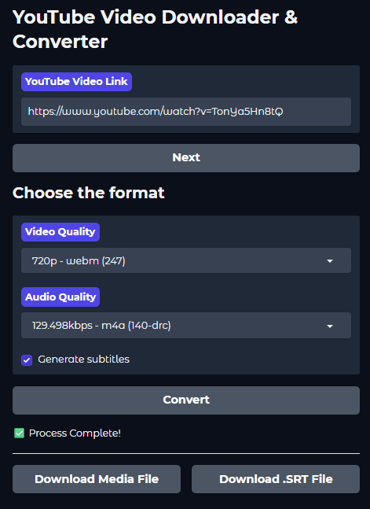

# Self-Hosted YouTube Downloader & Converter

This project provides a powerful, self-hosted web application for downloading YouTube videos and audio. It features an intuitive Gradio interface, robust subtitle generation via the Groq API, and is designed for easy deployment with Docker.

The application allows you to select specific video and audio qualities, download audio-only `.mp3` files, and automatically generate and embed subtitles into your video files, creating a single, self-contained media file.



## Features

-   **High-Quality Downloads**: Choose from all available video and audio formats for any YouTube video.
-   **Audio-Only Mode**: Download any video directly as a high-quality `.mp3` file.
-   **AI-Powered Subtitles**: Automatically generate accurate, timestamped subtitles (`.srt`) using the Groq API with Whisper models.
-   **Embedded Subtitles**: When downloading a video with subtitles, the `.srt` file is automatically embedded into the final `.mp4` container for a single, convenient media file.
-   **Robust API Key Management**: Configure multiple Groq API keys. The application will automatically shuffle and rotate keys to handle rate limits gracefully.
-   **Efficient Audio Processing**: Downloads audio only once. If the bitrate is too high for the transcription API, it creates a temporary, compressed version on the fly.
-   **User-Friendly Interface**: A clean web UI powered by Gradio with a step-by-step progress bar to monitor the conversion process.
-   **Secure & Private**: Self-host the application to ensure your download history remains private. Optional username/password authentication is included.
-   **Dockerized**: Deploy with ease using the provided `docker-compose.yml` files.

## Prerequisites

-   [Docker](https://docs.docker.com/get-docker/)
-   [Docker Compose](https://docs.docker.com/compose/install/)

## Deployment

There are two methods to deploy this application, depending on your needs.

### Method 1: Standard Deployment

This is the simplest method and works for most users.

**Step 1: Create `docker-compose.yml`**

Create a file named `docker-compose.yml` with the following content:

```yaml
services:
  ytdownloader:
    build:
      context: https://github.com/procrastinando/Selfhosted-Youtube-Downloader.git#main
    image: procrastinando/ytdownloader:latest
    container_name: ytdownloader
    ports:
      - 7860:7860
    tty: true
    environment:
      # --- REQUIRED: Add your Groq API Keys, separated by commas ---
      GROQ_API_KEYS: "gsk_key1,gsk_key2,gsk_key3"

      # --- OPTIONAL: Change the Whisper model if needed ---
      WHISPER_MODEL_ID: "whisper-large-v3"

      # --- OPTIONAL: Set credentials to enable the login page ---
      GRADIO_USERNAME: "admin"
      GRADIO_PASSWORD: "Your_Secure_Password_Here"
      
    volumes:
      - ./downloads:/downloads # Mount a local folder to access your files
    restart: unless-stopped

```
*Note: We use `./downloads` to make the downloaded files easily accessible on your host machine.*

**Step 2: Configure Environment Variables**

-   **`GROQ_API_KEYS`**: **(Required)** Replace `"gsk_key1,gsk_key2,gsk_key3"` with your own comma-separated Groq API keys. You can get them from the [Groq Console](https://console.groq.com/keys).
-   **`GRADIO_USERNAME` / `GRADIO_PASSWORD`**: **(Optional but Recommended)** Set these to enable a login screen for your application. If you leave them blank, the app will be accessible to anyone on your network.

**Step 3: Launch the Application**

Run the following command from your terminal in the same directory as the `docker-compose.yml` file:
```bash
docker-compose up -d
```
The application will be available at `http://<your-server-ip>:7860`.

---

### Method 2: Advanced Deployment (with VPN)

Use this method if your server's IP address is blocked or rate-limited by YouTube, or if your ISP restricts access. This configuration routes all of the application's traffic through a VPN using the popular [Gluetun](https://github.com/qdm12/gluetun) container.

**Step 1: Create `docker-compose.yml`**

Use this content for your `docker-compose.yml` file:

```yaml
services:
  gluetun:
    image: qmcgaw/gluetun
    container_name: YTdownloader-gluetun
    cap_add:
      - NET_ADMIN
    devices:
      - /dev/net/tun:/dev/net/tun
    ports:
      - 7860:7860 # Expose the Gradio port through the VPN
    volumes:
      - ./gluetun_config:/gluetun # Persist VPN configuration
    environment:
      # --- REQUIRED: Configure your VPN Provider ---
      - VPN_SERVICE_PROVIDER=surfshark
      - VPN_TYPE=wireguard
      - WIREGUARD_PRIVATE_KEY=xxxxxxxxxxxxxxxxxxxxxxxxxxx= # <-- Your private key
      - WIREGUARD_ADDRESSES=10.14.0.2/16 # <-- Address provided by your VPN
      
      # --- OPTIONAL: Choose a specific server ---
      # - SERVER_COUNTRIES=Switzerland
      # - SERVER_CITIES=Zurich
      - SERVER_HOSTNAMES=nl-ams-st001.prod.surfshark.com
    restart: unless-stopped

  ytdownloader:
    build:
      context: https://github.com/procrastinando/Selfhosted-Youtube-Downloader.git#main
    image: procrastinando/ytdownloader:latest
    container_name: ytdownloader
    # This is the magic line that routes traffic through Gluetun
    network_mode: service:gluetun
    tty: true
    depends_on:
      - gluetun
    environment:
      GROQ_API_KEYS: "gsk_key1,gsk_key2,gsk_key3"
      WHISPER_MODEL_ID: "whisper-large-v3"
      GRADIO_USERNAME: "admin"
      GRADIO_PASSWORD: "Your_Secure_Password_Here"
    volumes:
      - ./downloads:/downloads # Mount a local folder
    restart: unless-stopped
```

**Step 2: Configure VPN & Application Variables**

1.  **Configure Gluetun**: In the `gluetun` service, update the `environment` variables to match your VPN provider's details. The example uses Surfshark with WireGuard, but Gluetun supports dozens of providers. See the [Gluetun Wiki](https://github.com/qdm12/gluetun-wiki) for details on your specific provider.
2.  **Configure `ytdownloader`**: The environment variables for `ytdownloader` are the same as in the standard deployment.

**Step 3: Launch the Application**
```bash
docker-compose up -d
```
The application is now running, and all its requests to YouTube and Groq are routed through your VPN. Access it at `http://<your-server-ip>:7860`.

## How to Use

1.  Navigate to the web interface and log in if you have authentication enabled.
2.  Paste a YouTube video URL into the text box and click **Next**.
3.  Wait a moment for the application to fetch available formats.
4.  Select your desired **Video Quality** and **Audio Quality** from the dropdowns.
5.  (Optional) Check the **Generate subtitles** box.
6.  Click **Convert**.
7.  A progress bar will appear, showing the current step (Downloading, Transcribing, Merging, etc.).
8.  Once the process is complete, "Download Media File" and (if generated) "Download .SRT File" buttons will appear. Click them to save your files.
